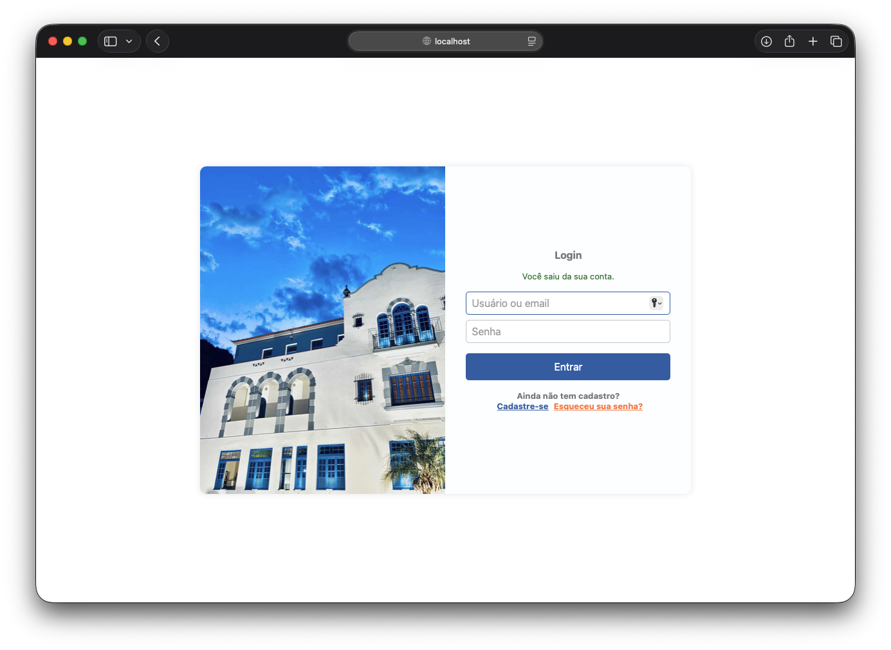
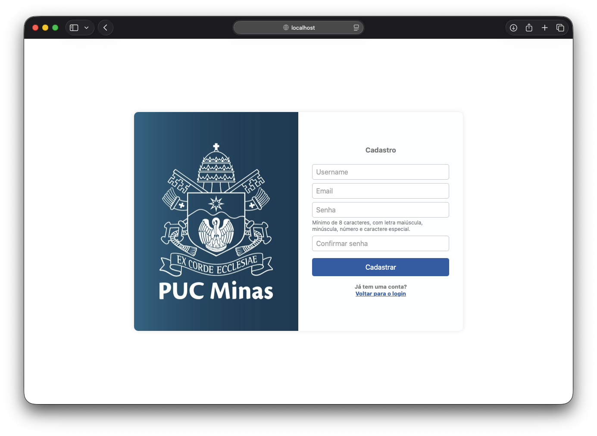
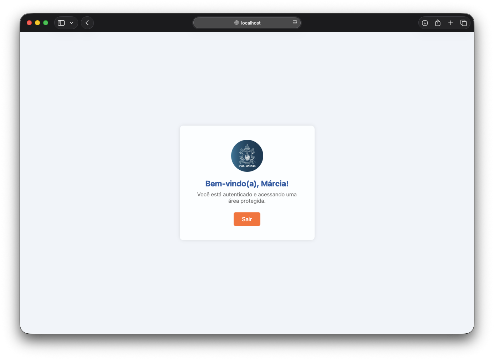
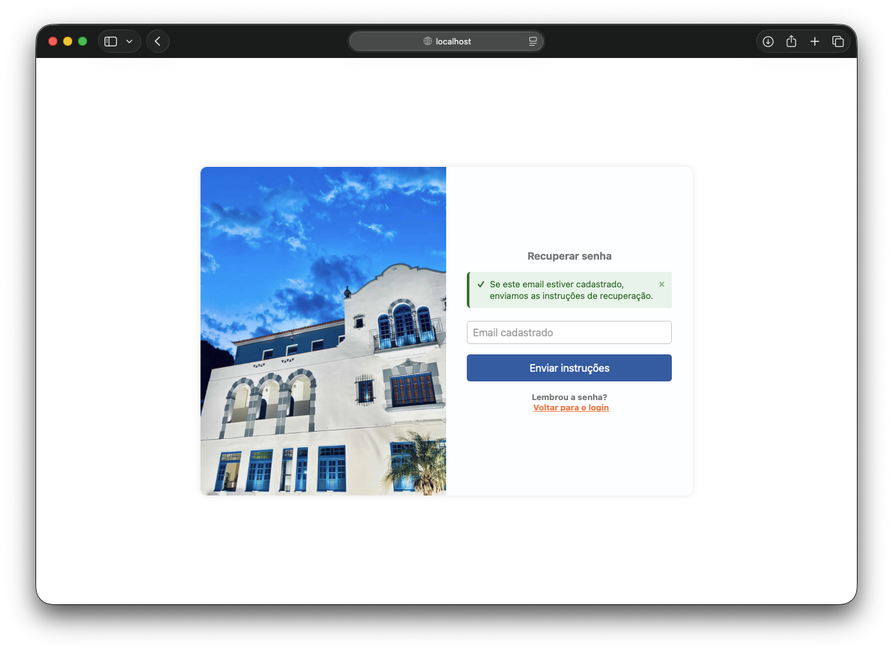

# LoginPUC

Aplicação web de autenticação construída com Spring Boot e Thymeleaf: cadastro de usuários, login, área protegida e **recuperação de senha por email**, com token de uso único enviado por SMTP.

Projeto da disciplina de Desenvolvimento e Integração de Aplicações Web — PUC Minas.

---

## Stack

| Camada | Tecnologia |
|---|---|
| Linguagem | Java 25 |
| Framework | Spring Boot 4.1.1 |
| Templates | Thymeleaf |
| Segurança | Spring Security (senhas em BCrypt) |
| Persistência | Spring Data JPA + Hibernate |
| Banco | H2 (arquivo local) |
| Email | Spring Boot Mail (JavaMailSender / SMTP) |
| Build | Maven |

---

## Telas

### Login



### Cadastro



### Área autenticada



### Recuperação de senha enviada



---

## Funcionalidades

- **Cadastro** com validação de campos: usuário entre 3 e 50 caracteres, email válido, senha forte (mínimo 8 caracteres com maiúscula, minúscula, número e caractere especial) e confirmação de senha.
- **Login** por nome de usuário **ou** email, processado pelo Spring Security.
- **Área protegida** (`/home`), acessível apenas com sessão autenticada.
- **Recuperação de senha por email**, com token aleatório de uso único e validade de 30 minutos.
- **Notificações padronizadas** em todas as telas, através de um fragmento Thymeleaf compartilhado.

---

## Como rodar

### Pré-requisitos

- JDK 25
- Maven 3.9+
- Uma conta Gmail com verificação em duas etapas ativada (para o envio de email)

### 1. Configure o envio de email

Este passo é **obrigatório** para a recuperação de senha funcionar. Veja a seção [Configuração do envio de email](#configuração-do-envio-de-email) logo abaixo — é o ponto que mais gera dúvida no projeto.

### 2. Rode a aplicação

```bash
mvn spring-boot:run -Dspring-boot.run.profiles=local
```

A aplicação sobe em `http://localhost:8080`.

---

## Configuração do envio de email

Esta é a parte que costuma travar quem roda o projeto pela primeira vez. A explicação abaixo é longa de propósito.

### Por que preciso colocar meu email e minha senha?

A aplicação **não é um servidor de email** — ela não sabe entregar mensagens na internet. O que ela faz é se conectar a um servidor SMTP (no caso, o do Gmail) e pedir que ele entregue a mensagem. É exatamente o que o Outlook, o Thunderbird e o app de email do seu celular fazem.

E o Gmail precisa saber **quem está pedindo**. A mensagem sai assinada como `seu.email@gmail.com`; se qualquer programa pudesse enviar em nome de qualquer endereço sem provar nada, golpe de phishing seria trivial. A credencial é como você prova que a conta é sua.

Ou seja: **não existe modo automático**. O email configurado é a conta que assina os envios do sistema — não tem relação com quem recebe. Se a Maria pedir recuperação de senha, o email sai da conta configurada e chega na caixa dela.

### Por que uma "senha de app" e não a minha senha normal?

O Google desativou o acesso SMTP com a senha da conta em 2022. Hoje é preciso gerar uma **senha de app**: uma credencial de 16 caracteres que serve só para esse uso e pode ser revogada sozinha, sem mexer na sua conta.

Para gerar:

1. A conta precisa ter **verificação em duas etapas** ativada.
2. Acesse **https://myaccount.google.com/apppasswords** (o item não aparece mais na tela de verificação em duas etapas; use o link direto).
3. Dê um nome qualquer (ex.: `LoginPUC`) e clique em **Criar**.
4. Copie os 16 caracteres **sem os espaços**. O Google só mostra uma vez.

### Onde colocar as credenciais

Crie o arquivo `src/main/resources/application-local.properties` com **três** linhas:

```properties
spring.mail.username=seu.email@gmail.com
spring.mail.password=suasenhade16caracteres
app.mail.from=seu.email@gmail.com
```

Depois rode com o perfil `local` ativo:

```bash
mvn spring-boot:run -Dspring-boot.run.profiles=local
```

> **Atenção:** esse arquivo está no `.gitignore` e **não deve ser commitado**. Credencial em repositório permanece no histórico do Git mesmo depois de apagada do arquivo.

### As três propriedades, e por que são três

| Propriedade | Para que serve |
|---|---|
| `spring.mail.username` | Autentica no servidor SMTP do Gmail |
| `spring.mail.password` | A senha de app, também para a autenticação |
| `app.mail.from` | O endereço que aparece como remetente da mensagem |

A terceira é a que mais passa despercebida. Configurar só as duas primeiras faz a aplicação falhar com `Could not parse mail`, porque a mensagem sai sem remetente. **O `app.mail.from` precisa ser o mesmo endereço do `spring.mail.username`** — o Gmail recusa enviar assinando um endereço diferente do que foi autenticado.

No `application.properties` (versionado) essas três propriedades apontam para variáveis de ambiente:

```properties
spring.mail.username=${MAIL_USERNAME:}
spring.mail.password=${MAIL_PASSWORD:}
app.mail.from=${MAIL_USERNAME:}
```

Se preferir variáveis de ambiente ao arquivo `-local`, exporte-as **no mesmo terminal** e **antes** de subir a aplicação:

```bash
export MAIL_USERNAME=seu.email@gmail.com
export MAIL_PASSWORD=suasenhade16caracteres
mvn spring-boot:run
```

### Alternativa sem Gmail: servidor de email local

Para desenvolver sem credencial nenhuma, use um servidor SMTP de teste como o [Mailpit](https://mailpit.axllent.org/). Ele finge ser um servidor de email, captura as mensagens e mostra numa interface web — nada é entregue de verdade.

```bash
brew install mailpit
mailpit
```

E no `application-local.properties`:

```properties
spring.mail.host=localhost
spring.mail.port=1025
spring.mail.properties.mail.smtp.auth=false
app.mail.from=nao-responda@loginpuc.local
```

Os emails aparecem em `http://localhost:8025`, com o link de recuperação clicável.

### Problemas comuns

| Sintoma | Causa | Solução |
|---|---|---|
| `Falha ao enviar e-mail: Could not parse mail` | `app.mail.from` vazio — a mensagem saiu sem remetente | Adicione a linha `app.mail.from` ao `application-local.properties` |
| `535-5.7.8 Username and Password not accepted` | Senha de app incorreta, ou foi usada a senha normal da conta | Gere uma senha de app de 16 caracteres |
| A tela diz que enviou, mas nada acontece e o log não mostra erro | O perfil `local` não está ativo, então o arquivo de credenciais é ignorado | Confira se o log traz `The following 1 profile is active: "local"` |
| `Database may be already in use` ao rodar `mvn clean install` | O H2 em arquivo aceita uma conexão por vez, e a aplicação está rodando | Pare a aplicação antes de rodar os testes |

> A tela de recuperação **sempre** mostra a mesma mensagem, tenha o email sido enviado ou não. Isso é proposital (veja [Decisões de segurança](#decisões-de-segurança)). Para saber o que realmente aconteceu, **olhe o console** — falhas de envio aparecem lá como `Falha ao enviar email de recuperação`.

---

## Como funciona a recuperação de senha

A senha fica gravada como hash BCrypt, que é irreversível — **ela não pode ser reenviada**. O que o sistema faz é provar que a pessoa controla o email cadastrado e, só então, deixar cadastrar uma senha nova.

```
1. Usuário informa o email em /recoverpassword
2. Sistema gera um token aleatório de 256 bits
3. Guarda no banco apenas o hash SHA-256 do token
4. Envia por email um link: /resetpassword?token=<token em claro>
5. Usuário abre o link; o token é validado (existe? expirou?)
6. Usuário cadastra a nova senha
7. Token é apagado e as sessões abertas do usuário são derrubadas
```

O token vale **30 minutos** e funciona **uma única vez**. Ambos os prazos são configuráveis:

```properties
app.reset-token-ttl-minutes=30
app.reset-token-cooldown-minutes=2
```

---

## Decisões de segurança

- **Senhas em BCrypt.** Hash com sal, irreversível.
- **Token guardado como hash SHA-256.** O token em claro só existe dentro do email. Quem ler o banco não consegue redefinir a senha de ninguém. É SHA-256 e não BCrypt porque a busca precisa ser feita pelo hash, e o token já tem entropia suficiente para tornar a força bruta inviável.
- **Mensagem genérica na recuperação.** A tela responde igual para email cadastrado ou não. Uma resposta diferente revelaria quais endereços existem no sistema.
- **Espera entre pedidos.** Dois minutos entre solicitações do mesmo usuário, para ninguém inundar a caixa de entrada de terceiros. O bloqueio só aparece no log, pelo mesmo motivo do item anterior.
- **Sessões derrubadas ao trocar a senha.** Trocar a senha não expulsa quem já estava logado — a sessão no servidor não tem relação com a senha no banco. Se a conta estava comprometida, o invasor continuaria dentro. Por isso as sessões são expiradas na redefinição.
- **Token de uso único**, apagado assim que a senha é trocada.

---

## Rotas

| Método | Rota | Acesso | Descrição |
|---|---|---|---|
| GET | `/login` | público | Formulário de login |
| POST | `/login` | público | Autenticação (Spring Security) |
| GET · POST | `/register` | público | Cadastro de usuário |
| GET · POST | `/recoverpassword` | público | Solicitação de recuperação de senha |
| GET · POST | `/resetpassword` | público | Cadastro da nova senha (exige token válido) |
| GET | `/home` | autenticado | Área do usuário |
| POST | `/logout` | autenticado | Encerra a sessão |
| POST | `/api/emails` | autenticado | Envio de email avulso (JSON) |
| GET | `/h2-console` | público | Console do banco H2 |

---

## Estrutura do projeto

```
src/main/java/com/example/LoginPUC/
├── config/
│   └── SecurityConfig.java           Rotas públicas, login, logout, registro de sessões
├── controller/
│   ├── HomeController.java
│   ├── LoginController.java
│   ├── RegisterController.java
│   ├── RecoverPasswordController.java   Solicitação de recuperação
│   ├── ResetPasswordController.java     Cadastro da nova senha
│   └── SendEmailController.java         Endpoint REST de email
├── dto/
│   ├── RegisterDTO.java
│   ├── ResetPasswordDTO.java
│   └── EmailRequestDTO.java
├── exception/
│   ├── SendEmailException.java
│   └── GlobalExceptionHandler.java
├── model/
│   └── User.java                     Usuário, hash do token e validade
├── repository/
│   └── UserRepository.java
└── service/
    ├── CustomUserDetailsService.java    Login por usuário ou email
    ├── SendEmailService.java            Encapsula o JavaMailSender
    ├── PasswordResetService.java        Regras da recuperação de senha
    └── SessionInvalidationService.java  Derruba sessões após troca de senha

src/main/resources/
├── templates/
│   ├── fragments/alerts.html         Fragmento de notificações compartilhado
│   ├── login.html
│   ├── register.html
│   ├── home.html
│   ├── recoverpassword.html
│   └── resetpassword.html
├── static/css/
├── static/js/alerts.js
├── application.properties            Configuração versionada
└── application-local.properties      Credenciais (fora do Git)
```

---

## Banco de dados

H2 em arquivo, criado automaticamente em `data/loginpuc.mv.db` na primeira execução. A pasta `data/` está no `.gitignore`.

Console web disponível em `http://localhost:8080/h2-console`:

| Campo | Valor |
|---|---|
| JDBC URL | `jdbc:h2:file:./data/loginpuc` |
| Usuário | `sa` |
| Senha | *(vazio)* |

O schema é gerado pelo Hibernate (`ddl-auto=update`). Vale saber que esse modo **cria** colunas novas mas nunca remove as antigas: colunas de versões anteriores continuam no banco, sem uso.
